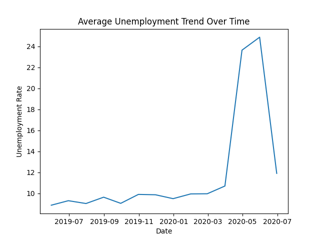
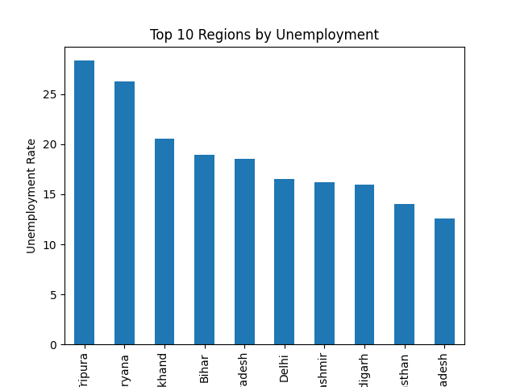
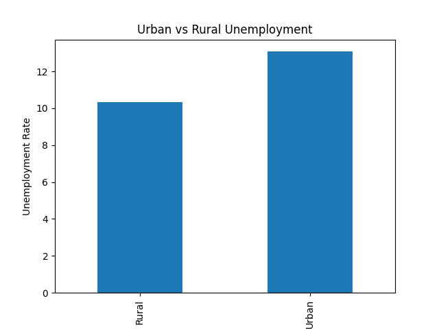
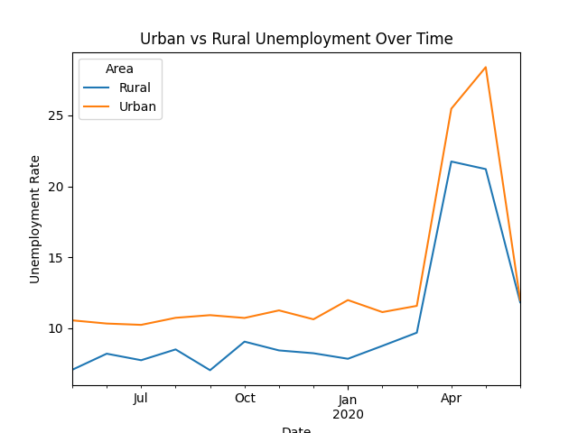

# 📊 Unemployment Analysis in India

## 📌 Overview

This project analyzes unemployment trends in India using Python, focusing on data cleaning, visualization, and the impact of COVID-19.

## 🎯 Objectives

* Analyze unemployment trends over time
* Study the impact of COVID-19 on employment
* Compare unemployment across regions and areas
* Extract meaningful insights from data

## 🔧 Tools Used

* Python
* Pandas
* Matplotlib

## 📊 Key Analysis

### Time Trend

* Stable unemployment (~9–10%) before 2020
* Sharp spike (~25%) during COVID lockdown
* Gradual recovery after

### Region Analysis

* Highest: Tripura, Haryana
* Lowest: Meghalaya, Odisha

### Area Analysis

* Urban unemployment higher than rural

### COVID Impact

* Significant increase in unemployment during pandemic

## 📈 Visualizations

## 🧠 Data Handling

* Missing values handled using mean (numeric) and mode (categorical)

## 🚀 Conclusion

COVID-19 had a major impact on unemployment, especially in urban areas.
